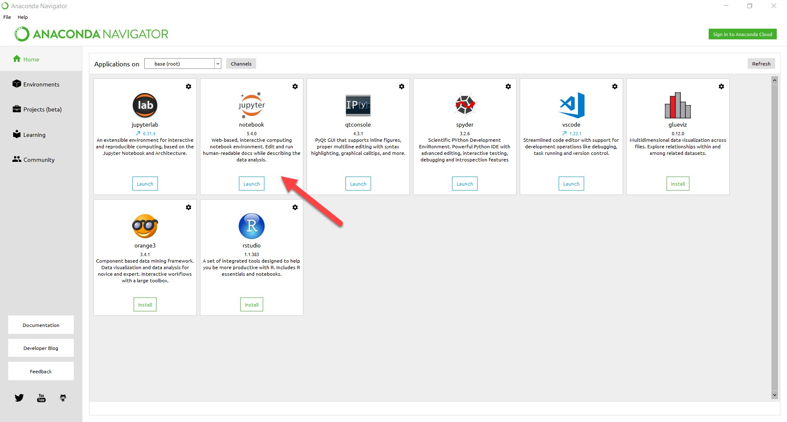

# Assessment 2019 Machine Learning & Statistics
Etain's submission for Assessment 2019 module Machine Learning & Statistics as part of the Higher Diploma in Data Analytics. 

Due: Friday December 13th, 2019 ~~November 29th, 2019~~ 

This module is worth 5 credits.

Update: Ian has kindly given students an extension to the deadline for this project. The project will now be due any time on or before Friday December 13th.

## Module: Machine learning and statistics (52954)
## Lecturer: Dr Ian McLoughlin
## Student: Etain Upton G00318876
## Assessment 2019 - Due: ~~November 29th, 2019~~ Friday December 13th, 2019

The README should contain a summary of your work and provide instructions as to how to run the jupyter notebook and the web application. 
A better project will be well laid out, clear and concise, and easily understood and run.

Submission: The submission for this assessment is in the form of a single GitHub repository.

### Summary of Etain’s work:

Within my Jupyter Notebook I have laid out my answer to this assessment in 3 parts; 

* Part 1 – Describe (20%) – Please find the git repository I created specifically for this assessment, which I have made available online for my lecturer to clone. This repository contains all my work for this assessment. Within this repository I include a jupyter notebook which uses descriptive statistics and plots to describe the Boston House Prices dataset. I have tried to ensure that this includes a good summary of the dataset, that my repository is well laid-out and organised, and that there are reasonable commits to this repository.

* Part 2 – Infer (20%) – I deduced / concluded my findings in relation to homes bordering the Charles River and homes not bordering the Charles River and the impact on housing prices within this data set from evidence and reasoning.

* Part 3 – Predict (60%) – I used keras to create a neural network that can predict the median house price based on the other variables in the dataset.

I have included the list of references I have used in this assessment, along with initial feedback from my lecturer Dr. Ian McLoughlin, and a ‘To Do’ list which I composed and which served as a guide for me while completing this assessment. 

My Jupyter Notebook contains code which I have taken from various resources, and some of which I have altered for my own specific purposes in line with the requirements for this assessment. I have explained how to run and why I have run this code within the Jupyter Notebook.

As outlined by Dr. Ian McLoughlin in the assessment description;

This assessment concerns the well-known Boston House Prices dataset and the Python packages scipy, keras, and jupyter. 

The project is worth 100% of the marks for this module, but it is broken into three parts, as follows;

*	(20%) Describe: Create a git repository and make it available online for the lecturer to clone. The repository should contain all your work for this assessment. Within the repository, create a jupyter notebook that uses descriptive statistics and plots to describe the Boston House Prices dataset. This part is worth 20% of your overall mark.
*	(20%) Infer: To the above jupyter notebook, add a section where you use inferential statistics to analyse whether there is a significant difference in median house prices between houses that are along the Charles river and those that aren’t. You should explain and discuss your findings within the notebook. This part is also worth 20%.
*	(60%) Predict: Again using the same notebook, use keras to create a neural network that can predict the median house price based on the other variables in the dataset. You are free to interpret this as you wish — for example, you may use all the other variables, or select a subset. This part is worth 60%.

The minimum standard for this assessment is a git repository containing a README file written in Markdown and a jupyter notebook containing your work. The README should contain a summary of your work and provide instructions as to how to run the jupyter notebook and the web application. A better project will be well laid out, clear and concise, and easily understood and run.

Marking scheme;
The following marking scheme will be used to mark the project out of 100%. Students should note, however, that in certain circumstances the examiner’s overall impression of the project may influence marks in each individual component.
*	20% Describe; Good summary of the dataset, repository well laid-out and organised. Reasonable commits to the repository.
*	20% Infer; Appropriate analysis of the relationship between the median house price and whether the house borders the river, with good explanations of the analysis.
*	60% Predict; Well-trained neural network providing decent predictions of house prices based on the other variables. Good explanations of how to use the neural network and how it works.

                                                                *** 

##### Etain’s refresher on how to add a Jupyter Notebook:
It had been a few months since I'd used Jupyter Notebook, so I had forgotten the basics on how to use it correctly. 
I reviewed a repository I previously submitted for a different module in which I had submitted a Jupyter Notebook (https://github.com/EtainUpton/52465Programming-for-Data-An.-Assignments). I was able to quickly remind myself of how to correctly use the Jupyter Notebook again.

I accessed Jupyter via the Anaconda Navigator as shown in the below screenshot;

I should employ the use of Markdown cells – these cells allow the user to type text into the cell, but the cell will not expect Python code – it will expect text.

In order to utilise the Markdown Cell functionality the user must go to ‘Cell Type’ and click ‘Markdown’.

Some useful notes from the 'Jupyter Keyboard Shortcuts Video';

* For headings = #
* For bullet points = -
* Edit mode = green
* Command mode = blue (not in edit mode)
* Purpose of command mode = enable use of keyboard shortcuts more effectively. Example: move from cell to cell with the up and down keys.
* To move from edit to command mode: press Escape button on keyboard
* To move from command to edit = press enter

Some useful notes;
* How to change from a code cell to a markdown cell: press ‘m’ for markdown on your keyboard.
* To convert back to code from markdown: press ‘y’
* You can type any valid python code into a code cell. Then hold down shift & enter. Output provided to jupyter and displayed under the cell.
* Markdown cells: double click on the rendered cell to edit it again.
* One # = top level heading.
* To make markdown cells to look more attractive (to render the cell) hold down shift and press enter on keyboard.

I utilised a github guide named ‘Mastering Markdown’; https://guides.github.com/features/mastering-markdown/
